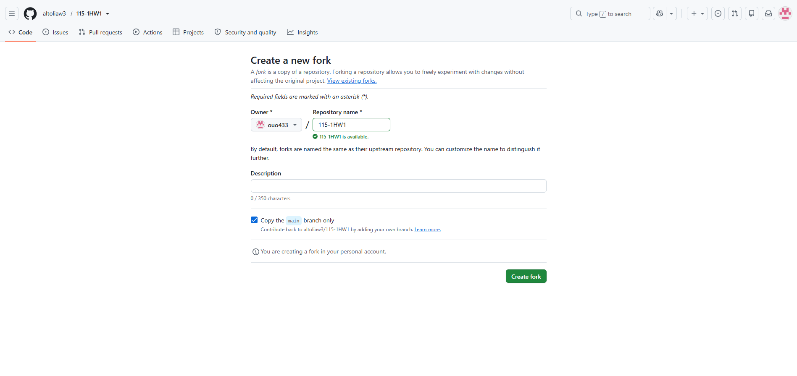
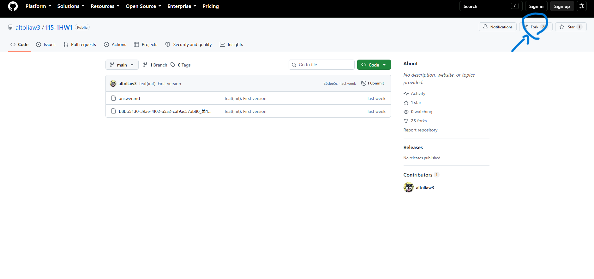
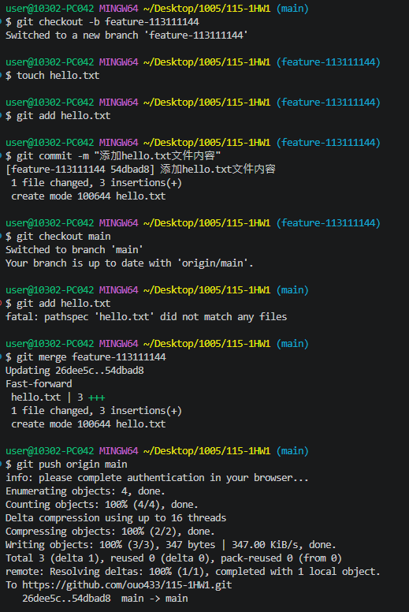

# 第1次作業題目-隨堂-HW1
>
>學號：113111144
> 
>姓名：徐詠姍
> 
>作業撰寫時間：180min
> 
>最後撰寫文件日期：2023/10/05
>

本份文件包含以下主題：(至少需下面兩項，若是有多者可以自行新增)
- [x] 說明內容
- [x] 其他 (可以包含心得或是想跟老師反映)

## 說明內容

1. 
Ans:
 

點擊右上角的fork
 
2. 
Ans:
 
3. 
Ans:
 

 
git checkout -b feature-113111144 建立並直接切換到新分支
 
touch 快速建立一個全新的空白檔案
 
git commit -m "說明" 存檔跟說明
 
git checkout main 切回main分支
 
git merge feature-113111144 合併分支
 
git push origin main 把本地端的 main 分支成果上傳到 GitHub 遠端倉庫

4. 
Ans:
 

 

## 其他
好難看 布幕反光 切螢幕好啊 